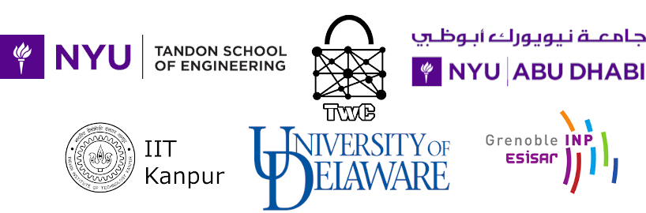

CSAW 2023 Embedded Security Challenge (ESC)
===========================================
## Quick Links

* [!!Finals Leaderboard](https://github.com/TrustworthyComputing/csaw_esc_2023/blob/main/Finals-Leaderboard.md)
* [Final Phase](https://github.com/TrustworthyComputing/csaw_esc_2023/blob/main/Final_Phase.md)
* [Deliverables](https://github.com/TrustworthyComputing/csaw_esc_2023/blob/main/deliverables.md)
* [Deadlines/Logistics (Updated to 11/6)](https://github.com/TrustworthyComputing/csaw_esc_2023/blob/main/logistics.md#competition-deadlines)
* [Challenge Description](https://github.com/TrustworthyComputing/csaw_esc_2023/blob/main/Challenge_Description.md)
* [csaw.io/esc](https://www.csaw.io/esc)
* [Finalists](https://github.com/TrustworthyComputing/csaw_esc_2023/blob/main/finalists.md)

## Overview

The Embedded Security Challenge (ESC) returns in 2023 for the 16th time, and we are proud to announce another exciting and educational global competition! ESC is part of [CSAW](https://www.csaw.io/), which is founded by the department of Computer Science and Engineering at NYU Tandon School of Engineering, and is the most comprehensive student-run cyber security event in the world, featuring international competitions, workshops, and industry events.

ESC 2023 will be held in four regions: US-Canada, Europe, Middle East & North Africa, and India, with the finals taking place on 8-11 November 2023.

-   **CSAW US-Canada**: NYU Tandon School of Engineering, Brooklyn, USA.
-   **CSAW Europe**: Grenoble Institute of Technology - ESISAR, Grenoble, France.
-   **CSAW MENA**: NYU Abu Dhabi, Abu Dhabi, UAE.
-   **CSAW India**: Indian Institute of Technology Kanpur, Kanpur, India.

The competition is organized in all regions under the supervision of Professor Nektarios Tsoutsos (University of Delaware), the global challenge leads are Lars Folkerts, Charles Gouert and Rostin Shokri, who are also the US-Canada region challenge leads, and Brandon Bauer.
In Europe, the competition is organized by Professor David Hely (Grenoble INP), Amir-Pasha Mirbaha (Grenoble INP), and Ihab Alshaer (Université Grenoble Alpes).
In the MENA region, the competition is coordinated by Professor Michail Maniatakos (NYUAD). 
In India, ESC is supervised by Professors Debapriya Basu Roy and Urbi Chatterjee (IIT Kanpur), with Suraj Mandal and Dipesh  as the regional challenge lead.

## Challenge Summary
This year's ESC focuses on side channel attacks (SCA) on cyber-physical systems (CPS). Cyber-physical systems are used by hundreds of industries and in many critical infrastructure systems. If these CPSs are not properly setup they can leak information even if they are using cryptographically secure software. This year, teams will investigate a range of SCAs on an Arduino Uno based CPS running several firmware that expose various side channels. 

The event comprises a qualification and a competition phase where teams will be able to explore several variations of a CPS and exploit side channels they find while suggesting mitigations for the found exploits.

## Registration

Students of all university levels are invited to compete. Each team must have a **team leader** and up to 3 additional team members (a total of 4 participants per team). Each team leader is responsible for coordinating with other members of their team and will be the point of contact for the entire team. Each team should also have a university **faculty advisor**.

The team leaders need to register their team members and faculty advisor electronically at https://hotcrp.engineering.nyu.edu/, using their team name as the 'Submission Title'. ESC uses a HotCRP-based registration and submission system for both the qualification and final rounds, and teams **must register before finalizing their report and computer file submissions** by the posted deadlines.

Each team is eligible to register for **only one region** based on university affiliation: Europe, India, MENA, or US-Canada, as defined below.
While team members do not need to attend the same university, all team members must be a part of the same region.

-   **US-Canada**: Hosting students from universities located within the United States or Canada.
-   **Europe:** Hosting students from universities located in the European Union, Switzerland, Norway, Armenia, United Kingdom.
-   **India:** Hosting students from universities located in India.
-   **MENA:** Hosting students from universities located in Algeria, Azerbaijan, Bahrain, Chad, Djibouti, Egypt, Eritrea, Georgia, Iran, Iraq, Israel, Jordan, Kuwait, Lebanon, Libya, Mauritania, Morocco, Oman, Pakistan, Palestine, Qatar, Saudi Arabia, South Sudan, Sudan, Syria, Tunisia, Turkey, United Arab Emirates, or Yemen.

To be able to qualify to the final round, each team must register for the correct region based on the university affiliations of its members.

After registration closes, making changes to the existing members of a team (e.g., replacing a team member) or adding new team members, requires explicit permission from the organizers. This is also necessary for teams replacing team members or adding new team members during the final round of the competition.

For more registration information, policies, deadlines, and for information for contacting CSAW organizers, visit the [logistics](logistics.md) page. For information about final phase submissions, please visit the [deliverables](deliverables.md) page.

**Teams are encouraged to start investigating the challenge as early as possible.**

*It is also recommended to periodically visit this repository on GitHub, as the details may be updated*.

---

## Acknowledgments
The development this competition was partially supported by the National Science Foundation (Award #2234974).

## Partner institutions

    

[badge-license]: https://img.shields.io/badge/license-MIT-green.svg
